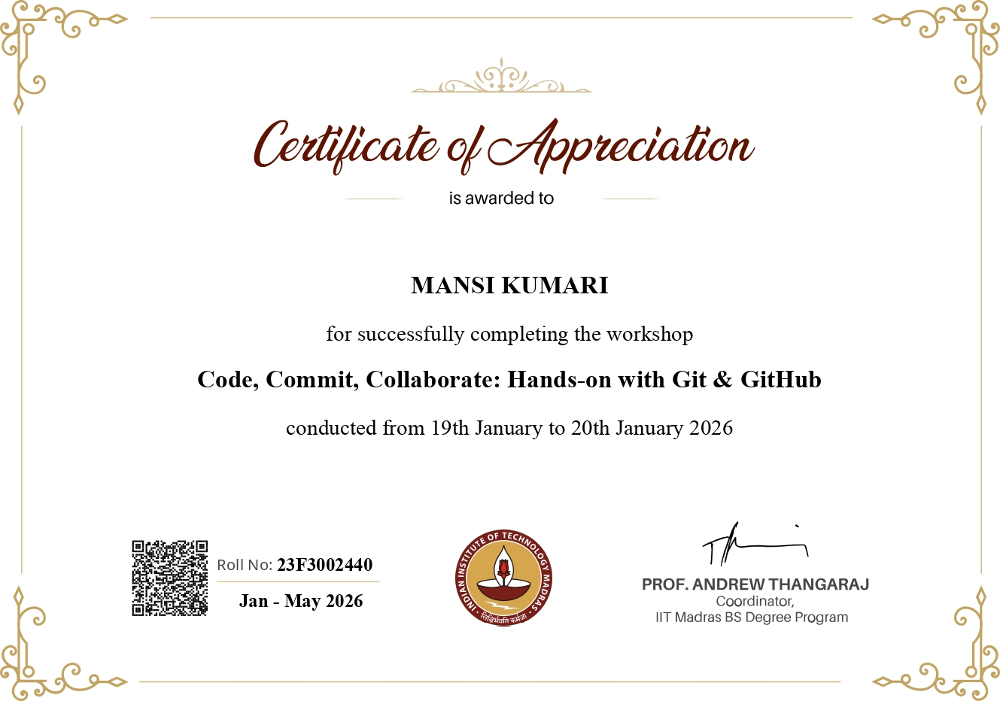

# 23f3002440_git_challenge_lab
This repository showcases the tasks and learnings from the GitHub Workshop conducted by IIT Madras.

## 📘 Learning Summary – GitHub Workshop (IIITM / IIT Madras)

This repository showcases the hands-on tasks and learnings gained from the **GitHub Workshop conducted by IIITM (IIT Madras)**.  
The workshop focused on building strong fundamentals in **version control, GitHub workflows, and collaborative development practices**.

### 🔑 Key Learnings:
- Understood the fundamentals of **Git and GitHub**
- Created and managed **GitHub repositories**
- Learned how to **add, track, and commit files**
- Gained experience with **commit history and version tracking**
- Practiced resolving **merge conflicts** using VS Code
- Learned to push changes from **local repository to GitHub**
- Understood real-world collaboration concepts used in software teams

### 🛠 Tools Used:
- Git (CLI)
- GitHub
- Visual Studio Code

### 🎯 Outcome:
This workshop strengthened my understanding of **source code management** and improved my confidence in using GitHub for academic projects, team collaboration, and real-world software development workflows.

## 🏅 Certificate – GitHub Workshop (IIITM / IIT Madras)

---

## 🧪 Workshop Tasks & Evidence

### ✅ Task 1: GitHub Basics & File Management

### ✅ Task 2: Version Control & Commit History

